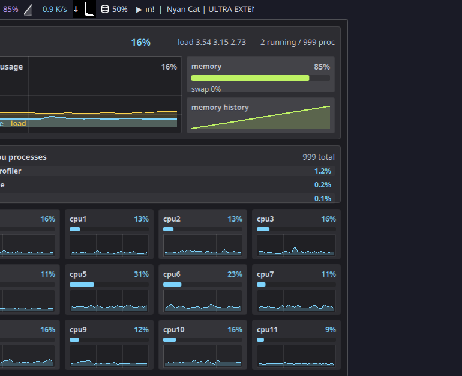
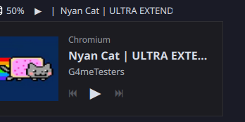
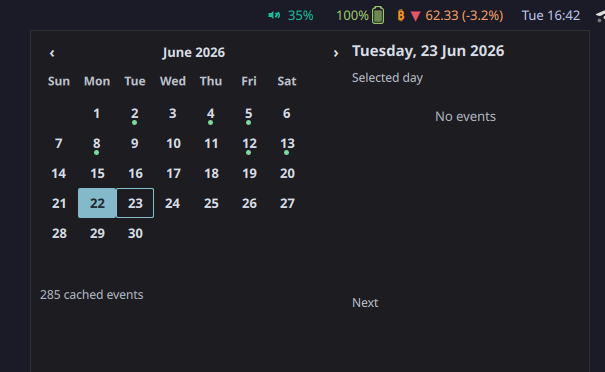
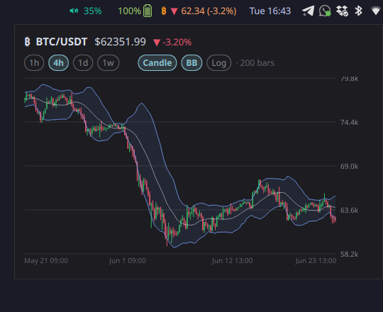
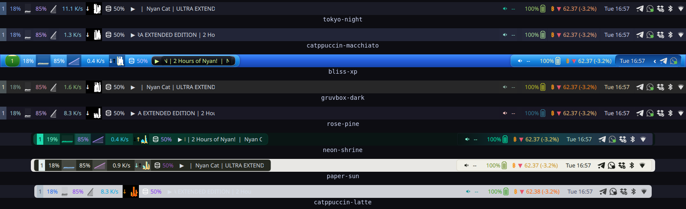
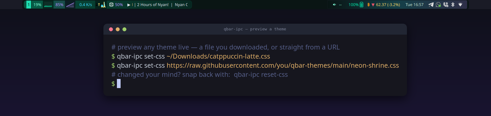

<div align="center">

# qbar

**A fast, CSS-themable status bar for Wayland and X11, built with Qt 6 / QML.**

Waybar-style modules, rich interactive popups, hot-reloadable custom QML widgets,
a JSON IPC for scripting, and a matching QML/PAM lock screen.


</div>

---

## Highlights

- **Wayland-native** via `wlr-layer-shell` (a custom Qt platform-shell integration), with an X11 dock/strut fallback.
- **Standard-CSS theming.** Themes are plain `.css` files — selectors like `#cpu`, `#workspaces button:active`, gradients, `box-shadow`, `border-radius`, transitions. 28 themes ship in [`config/themes/`](config/themes). Hot-reloads on save.
- **Rich popups**, not just tooltips: an interactive CPU/Memory dashboard (per-core graphs, top processes), a calendar with events, a Bitcoin candlestick chart, disk, battery, and media.
- **Custom QML widgets** loaded from disk at runtime (no recompile) — hot-reload on save. Plus **waybar-format custom tools** (external scripts) for drop-in compatibility.
- **JSON IPC** over a `QLocalSocket` — open/toggle popups from keyboard shortcuts or scripts.
- **Try a theme before you keep it.** `qbar-ipc set-css <path-or-URL>` hot-swaps the live bar to any stylesheet — even a remote one — so you can preview a community theme straight from a URL, or a file you just downloaded (a relative path resolves from your shell's cwd). `qbar-ipc reset-css` snaps back to your configured theme — no restart, no config edits.
- **Async by design.** Network (`QNetworkAccessManager`) and JSON parsing run off the GUI thread, and the marquee scrolls on the render thread, so the bar stays smooth.
- **qbar-lock**: an optional QML/PAM lock screen that shares qbar's CSS engine.

## Screenshots

A bar (Tokyo Night) with workspaces, CPU/memory/network graphs, disk usage and MPRIS now-playing on the left; an audio drawer, battery, a live BTC ticker, the clock, and the system tray on the right:


Popups (opened by click or over the IPC):

| System dashboard (per-core graphs, top processes) | Now playing (MPRIS) |
|---|---|
|  |  |
| **Calendar** (events from the local calendar) | **Bitcoin candlesticks** (scroll to zoom, hover for OHLC) |
|  |  |

A few of the 28 bundled themes — light and dark, including the Windows-XP-style `bliss-xp` — see the [full gallery](docs/assets/themes.png):



Preview a theme live before you commit to it — `qbar-ipc set-css` hot-swaps the running bar to any stylesheet (a file you just downloaded, or even straight from a URL); `qbar-ipc reset-css` snaps back to your configured theme:



## Building

qbar uses **Meson** + **Ninja** and targets **Qt 6.5+**.

**Build tools:** Meson, Ninja, a C++20 compiler, and (for the Wayland integration) `wayland-scanner` + `python3`.

**Dependencies:** Qt 6 (Core, Gui, Widgets, Network, Qml, Quick, DBus, WaylandClient), `sqlite3`, `xkbregistry`, `libedataserver-1.2` + `libecal-2.0` (calendar), `libpulse`. Optional: `wayland-client` + `wlroots-0.19` (Wayland layer-shell), `xcb` + `xcb-ewmh` (X11), `wireplumber-0.5` (native audio backend), `libpipewire-0.3` (privacy mic/camera indicator), `pam` (lock screen).

<details><summary>Distro package hints</summary>

- **Arch:** `meson ninja qt6-base qt6-declarative qt6-wayland sqlite libxkbcommon evolution-data-server libpulse wayland wlroots0.19` (plus `wireplumber libpipewire pam libxcb xcb-util-wm` for the optional bits).
- **Fedora:** the `qt6-qt*-devel` packages, `meson ninja-build sqlite-devel libxkbcommon-devel evolution-data-server-devel pulseaudio-libs-devel wayland-devel wlroots-devel` (+ `wireplumber-devel pipewire-devel pam-devel libxcb-devel xcb-util-wm-devel`).

</details>

```bash
meson setup build
ninja -C build
sudo ninja -C build install      # optional
```

Useful options (`-D<name>=<value>`):

| Option | Default | Description |
|---|---|---|
| `wayland` | `auto` | wlroots `wlr-layer-shell` integration |
| `x11` | `auto` | X11 dock/strut integration |
| `wm_backends` | `i3,hyprland` | window-manager backends: `i3`, `hyprland`, `bspwm`, `qtile`, `ewmh` |
| `wireplumber` | `auto` | native WirePlumber audio backend (else libpulse) |
| `privacy` | `auto` | mic/camera in-use indicator (needs `libpipewire-0.3`) |
| `lockscreen` | `auto` | build `qbar-lock` (needs `pam`) |
| `qml_debug` | `false` | enable the QML debug/profiler connector (development only) |

Run it: `qbar` (top bar by default). Flags: `--position top|bottom`, `--height N`, `--no-exclusive-zone`, `--no-wayland-layer-shell`.

## Configuration

qbar reads `$XDG_CONFIG_HOME/qbar/config.json` (default `~/.config/qbar/config.json`). See [`data/config.example.json`](data/config.example.json).

```jsonc
{
  "height": 30,
  "position": "top",
  "styleSheet": "~/.config/qbar/themes/tokyo-night.css",
  "windowManager": { "backend": "auto" },

  "modules-left":   ["Workspaces", "CPU", "Memory", "Network"],
  "modules-center": ["Clock"],
  "modules-right":  ["Temperature", "Sound", "Battery", "Tray"]
}
```

Built-in modules include: `Workspaces`, `Title`, `CPU`, `Memory`, `Network`, `NetworkManager`,
`Disk`, `Temperature`, `Sound`, `Battery`, `Brightness`, `Bluetooth`, `PowerProfiles`,
`Caffeine`, `XInput`, `Media` (MPRIS), `Clock`, `Tray`, and `CustomTool:<id>`.

## Theming

A theme is a single standard-CSS file pointed to by `styleSheet`. Elements are selected by
id (`#cpu`, `#clock`, `#media-label`), with parts and states (`#cpu.graph`, `#workspaces button:active`).
Supports gradients, `box-shadow` (incl. inset bevels), per-corner `border-radius`, and `transition`s.
Edit the file and the bar restyles live — no restart. Browse [`config/themes/`](config/themes) for examples.

## Custom widgets & tools

Two ways to extend the bar:

- **Custom QML widgets** — a `.qml` file loaded from disk at runtime (not compiled in), hot-reloaded on save. It can `import "qrc:/qbar"` (themed `CssRect`/`CssText`), read the `theme`/`cssTheme` and the data models, do async HTTP (`Fetch.js`) and async JSON (`Json.js`), and open its own popup. The bundled [`config/widgets/`](config/widgets) has live **Bitcoin** and **Weather** widgets.

  ```jsonc
  "modules-right": ["CustomTool:custom/btc"],
  "customTools": { "custom/btc": { "source": "widgets/Bitcoin.qml" } }
  ```

- **Custom tools** — waybar-format external scripts (`exec`, `interval`, `return-type: json`, `format`, `format-icons`, Pango markup), for drop-in compatibility with existing waybar modules.

## IPC

qbar exposes a small **JSON line-protocol IPC** over a `QLocalSocket` at
`$XDG_RUNTIME_DIR/qbar.sock` (override with `$QBAR_IPC_SOCKET`). One JSON object per line in,
one per line out. This makes it easy to bind a key to a popup, or swap themes while testing.

```jsonc
{"command":"toggle","popup":"cpu"}            // -> {"ok":true}
{"command":"open","popup":"memory"}           // -> {"ok":true}
{"command":"close","popup":"clock"}           // -> {"ok":true}
{"command":"close-all"}                       // -> {"ok":true}
{"command":"set-css","path":"/.../nord.css"}  // -> {"ok":true,"bars":1}   (live theme swap)
{"command":"list"}                            // -> {"ok":true,"popups":["cpu","memory","clock","battery","btc"]}
{"command":"ping"}                            // -> {"ok":true,"pong":true}
```

qbar ships a tiny client, **`qbar-ipc`**, so you don't have to hand-roll a socket client —
bind it to a key in your compositor:

```bash
qbar-ipc toggle cpu                         # prints the JSON reply; exit 0 on {"ok":true}
qbar-ipc open memory
qbar-ipc set-css ~/.config/qbar/themes/nord.css   # live theme swap (handy when testing)
qbar-ipc list
qbar-ipc ping
```

In **sway** (or i3) config:

```
bindsym $mod+c exec qbar-ipc toggle cpu
bindsym $mod+Shift+m exec qbar-ipc toggle memory
bindsym $mod+t exec qbar-ipc toggle clock
```

Popups are registered by name; any applet's popup can be exposed by giving its `QBar.Popup` a `name`.

## Documentation

Full reference docs (Sphinx) live in [`docs/`](docs/) — configuration, CSS theming, and the
custom-tools QML API. Build with `sphinx-build -b html docs docs/_build/html`.

- [Window-manager backends](docs/window-manager-backends.md)
- [Tray icon resolution](docs/tray-icon-resolution.md)

## License

See the repository for license details.
