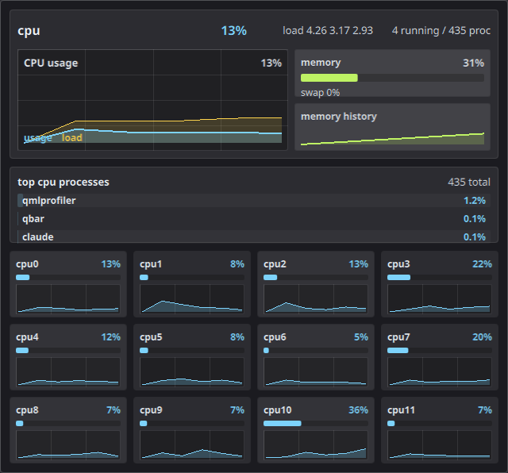
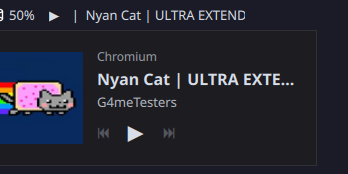
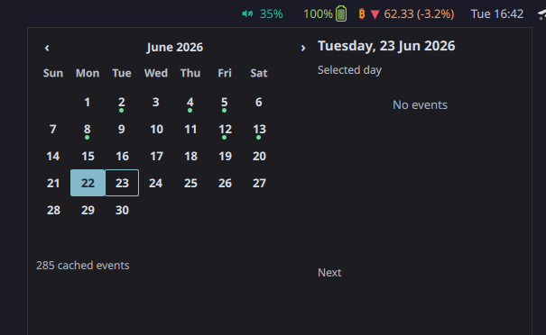
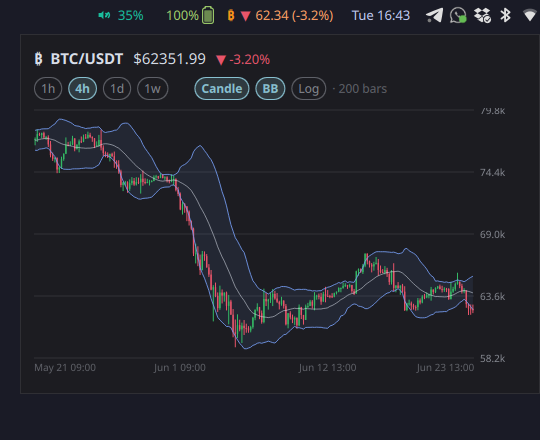
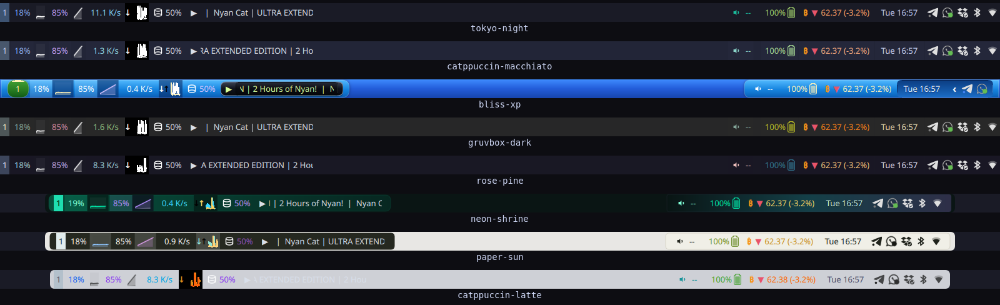
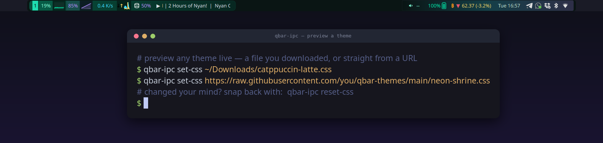
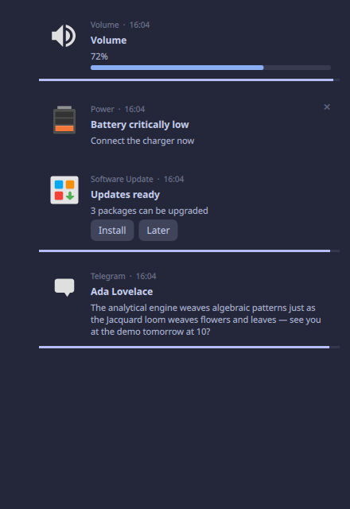
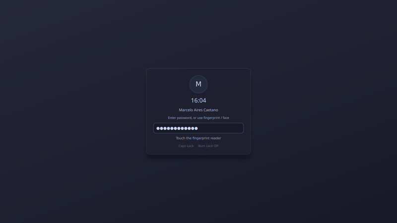
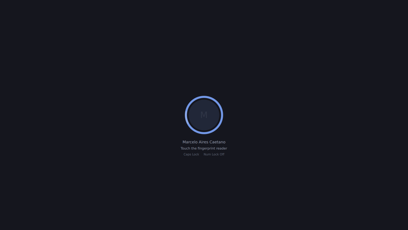

<div align="center">

# qbar

**A fast, CSS-themable status bar for Wayland and X11, built with Qt 6 / QML.**

[](https://github.com/caetanus/qbar/actions/workflows/build.yml)
[](https://github.com/caetanus/qbar/actions/workflows/tests.yml)

Waybar-style modules, rich interactive popups, hot-reloadable custom QML widgets,
a JSON IPC for scripting, and a matching QML/PAM lock screen.


</div>

---

## Highlights

- **Wayland-native** via `wlr-layer-shell` (a custom Qt platform-shell integration), with an X11 dock/strut fallback.
- **Standard-CSS theming.** Themes are plain `.css` files — selectors like `#cpu`, `#workspaces button:active`, gradients, `box-shadow`, `border-radius`, transitions. 28 themes ship in [`config/themes/`](config/themes). Hot-reloads on save. The engine grew up here and now lives as its own project, [qml-css-engine](https://github.com/caetanus/qml-css-engine) (vendored as a submodule) — docs, tests and the full cascade/specificity/`@media`/`@keyframes` story live there.
- **Rich popups**, not just tooltips: an interactive CPU/Memory dashboard (per-core graphs, top processes), a calendar with events, a Bitcoin candlestick chart, disk, battery, and media.
- **Custom QML widgets** loaded from disk at runtime (no recompile) — hot-reload on save, with async HTTP/JSON, process and storage globals, popups and menus. Four ship in the box (crypto ticker, weather, speed test, AI-quota). Plus **waybar-format custom tools** (external scripts) for drop-in compatibility. See [Custom widgets](#custom-widgets).
- **Redshift** — **new**: night colour temperature without a daemon — `wlr-gamma-control` on sway/Hyprland, XRandR on X11 — with sunrise/sunset computed locally from your location (or borrowed from the Weather widget), a preset menu and manual override.
- **JSON IPC** over a `QLocalSocket` — open/toggle popups from keyboard shortcuts or scripts.
- **Try a theme before you keep it.** `qbar-ipc set-css <path-or-URL>` hot-swaps the live bar to any stylesheet — even a remote one — so you can preview a community theme straight from a URL, or a file you just downloaded (a relative path resolves from your shell's cwd). `qbar-ipc reset-css` snaps back to your configured theme — no restart, no config edits.
- **Async by design.** Network (`QNetworkAccessManager`) and JSON parsing run off the GUI thread, and the marquee scrolls on the render thread, so the bar stays smooth.
- **Native notifications** — **new**: opt-in `org.freedesktop.Notifications` daemon (replaces dunst/mako) rendering toasts with the same CSS engine: frosted-glass blur, an emboss relief shader, `@keyframes` entry **and exit** animations, hover-to-expand, and stack-tag coalescing for volume/brightness OSDs. Actions, urgency states, progress/value gauges, and **inline reply** — answer a Telegram message straight from the toast (KDE `inline-reply` extension).
- **qbar-lock** — **new**: an optional QML/PAM lock screen that shares qbar's CSS engine. Wayland `ext-session-lock-v1` (a real session lock) or an X11 grab, with password + **fingerprint (fprintd)** + face (Howdy) racing in parallel — first to succeed unlocks.
- **Speaks your language.** `LANG`/`LC_MESSAGES` is honoured across the bar and the lock screen — translations ship for **pt_BR, pt_PT, français, Deutsch and español**, dates and weekday names follow your locale, and Qt's own component catalogs are loaded too.

## Screenshots

A bar (Tokyo Night) with workspaces, CPU/memory/network graphs, disk usage and MPRIS now-playing on the left; an audio drawer, battery, a live BTC ticker, the clock, and the system tray on the right:


Popups (opened by click or over the IPC):

| System dashboard (per-core graphs, top processes) | Now playing (MPRIS) |
|---|---|
|  |  |
| **Calendar** (events from the local calendar) | **Bitcoin candlesticks** (scroll to zoom, hover for OHLC) |
|  |  |

A few of the 28 bundled themes — light and dark, including the Windows-XP-style `bliss-xp` — see the [full gallery](docs/assets/themes.png):



Preview a theme live before you commit to it — `qbar-ipc set-css` hot-swaps the running bar to any stylesheet (a file you just downloaded, or even straight from a URL); `qbar-ipc reset-css` snaps back to your configured theme:



## Building

qbar uses **Meson** + **Ninja** and targets **Qt 6.5+**.

The CSS engine is vendored as a **git submodule** — clone with `--recursive`
(or run `git submodule update --init` in an existing checkout):

```bash
git clone --recursive https://github.com/caetanus/qbar.git
```

**Build tools:** Meson, Ninja, a C++20 compiler, Qt's `lrelease` (translations; `qt6-tools` on Arch), and (for the Wayland integration) `wayland-scanner` + `python3`.

**Build dependencies (required):** Qt 6 (Core, Gui, Widgets, Network, Qml, Quick, DBus, **Svg**, **WebSockets**), `sqlite3`, `xkbregistry`, `libedataserver-1.2` + `libecal-2.0` (calendar), `libpulse`. Optional: `wayland-client` + `wayland-protocols` (Wayland layer-shell — no wlroots needed: the protocol code is generated from bundled XML), `xcb` + `xcb-ewmh` (X11), `wireplumber-0.5` (native audio backend), `libpipewire-0.3` (privacy mic/camera indicator), `pam` (lock screen).

> Svg and WebSockets are **mandatory** even though qbar only imports them from QML — `meson.build` requires them so a build can't silently produce a bar that breaks at runtime (SVG icons failing, the Bitcoin widget not loading).

**Runtime requirements (often missing on minimal installs — every one breaks a band of applets, not the whole bar):**

| Need | Why | Arch | Debian/Ubuntu |
|---|---|---|---|
| Qt 6 QML modules: QtQuick, Controls, Templates, Effects, Shapes, Layouts, Window, WorkerScript, WebSockets | the applets/popups import them | `qt6-declarative` `qt6-websockets` | `qml6-module-qtquick*` `qml6-module-qtwebsockets` |
| **Qt SVG image plugin** | every `.svg` icon (`"Unsupported image format"` without it) | `qt6-svg` | `qt6-svg-plugins` |
| an **icon theme** with symbolic icons | the `themeicon://` provider (network/bt/battery glyphs) | `adwaita-icon-theme` (or any) | `adwaita-icon-theme` |
| **evolution-data-server** daemon | the Calendar applet's `Sources` D-Bus service (the dev libs alone are not enough) | `evolution-data-server` | `evolution-data-server` |

### Installing the dependencies

Qt 6 is split across many packages and easy to get subtly wrong (it builds, then
fails at runtime). These one-liners cover **build + runtime** in one go.

**Arch** — Qt's QML modules, SVG plugin and the WebSockets module all ship inside
the base Qt packages, so this is short:

```bash
sudo pacman -S --needed \
  meson ninja cmake \
  qt6-base qt6-declarative qt6-svg qt6-websockets \
  sqlite xkbcommon-x11 libpulse evolution-data-server \
  adwaita-icon-theme ttf-nerd-fonts-symbols ttf-roboto \
  qt6-wayland                      # Wayland (drop for X11-only)
# optional extras: wireplumber libpipewire pam libxcb xcb-util-wm
```

**Debian / Ubuntu** — Qt's QML modules and the SVG plugin are *separate* packages
(this is the usual i3 pitfall), so they must be named explicitly:

```bash
# build
sudo apt install \
  meson ninja-build cmake pkg-config g++ \
  qt6-base-dev qt6-base-private-dev \
  qt6-declarative-dev qt6-declarative-private-dev \
  qt6-svg-dev qt6-websockets-dev \
  libsqlite3-dev libpulse-dev libxkbcommon-dev libxkbregistry-dev \
  libedataserver1.2-dev libecal2.0-dev \
  libxcb1-dev libxcb-ewmh-dev          # X11 (or libwayland-dev wayland-protocols for Wayland)
# runtime — the pieces apt won't pull in for you
sudo apt install \
  qt6-svg-plugins \
  qml6-module-qtquick-controls qml6-module-qtquick-templates \
  qml6-module-qtquick-effects qml6-module-qtquick-shapes \
  qml6-module-qtquick-layouts qml6-module-qtwebsockets \
  qml6-module-qtqml-workerscript \
  adwaita-icon-theme evolution-data-server \
  fonts-jetbrains-mono fonts-roboto fonts-font-awesome
```

> The exact, verified Debian setup (every package, in build order) is the
> [`docker/Dockerfile`](docker/Dockerfile) — copy from there if in doubt.

**Fedora** — like Arch, the QML modules and the SVG image plugin ship inside the
base Qt packages, so the `-devel` set pulls the runtime libs in as dependencies:

```bash
sudo dnf install \
  meson ninja-build cmake gcc-c++ \
  qt6-qtbase-devel qt6-qtbase-private-devel \
  qt6-qtdeclarative-devel qt6-qtsvg-devel qt6-qtwebsockets-devel \
  sqlite-devel libxkbcommon-devel \
  evolution-data-server-devel pulseaudio-libs-devel \
  libxcb-devel xcb-util-wm-devel \
  adwaita-icon-theme jetbrains-mono-fonts-all google-roboto-fonts fontawesome-fonts \
  qt6-qtwayland-devel                        # Wayland (drop for X11-only)
# optional extras: wireplumber-devel pipewire-devel pam-devel
```

> A true Nerd Font (patched glyphs) isn't in Fedora's repos — grab one from
> [nerdfonts.com](https://www.nerdfonts.com/) if a theme needs the extra icons.

```bash
meson setup build
ninja -C build
sudo ninja -C build install      # optional
```

Useful options (`-D<name>=<value>`):

| Option | Default | Description |
|---|---|---|
| `wayland` | `auto` | Wayland `wlr-layer-shell` integration (bundled protocol XML; no wlroots) |
| `x11` | `auto` | X11 dock/strut integration |
| `wm_backends` | `i3,hyprland` | window-manager backends: `i3`, `hyprland`, `bspwm`, `qtile`, `ewmh` |
| `wireplumber` | `auto` | native WirePlumber audio backend (else libpulse) |
| `privacy` | `auto` | mic/camera in-use indicator (needs `libpipewire-0.3`) |
| `lockscreen` | `auto` | build `qbar-lock` (needs `pam`) |
| `qml_debug` | `false` | enable the QML debug/profiler connector (development only) |

Run it: `qbar` (top bar by default). Flags: `--position top|bottom`, `--height N`, `--no-exclusive-zone`, `--no-wayland-layer-shell`.

## Configuration

qbar reads `$XDG_CONFIG_HOME/qbar/config.json` (default `~/.config/qbar/config.json`). See [`data/config.example.json`](data/config.example.json).

```jsonc
{
  "height": 30,
  "position": "top",
  "styleSheet": "~/.config/qbar/themes/tokyo-night.css",
  "windowManager": { "backend": "auto" },

  "modules-left":   ["Workspaces", "CPU", "Memory", "Network"],
  "modules-center": ["Clock"],
  "modules-right":  ["Temperature", "Sound", "Battery", "Tray"]
}
```

Built-in modules include: `Workspaces`, `Title`, `Taskbar`, `Scratchpad`, `I3Mode`,
`SuperWorkspace` (super workspaces of the caetanus/i3 fork), `CPU`,
`Memory`, `Load`, `Temperature`, `Network`, `NetworkManager`, `Disk`, `Sound`, `Media` (MPRIS),
`Mpd`, `Battery`, `UPower` (peripheral batteries), `Brightness`, `Bluetooth`, `PowerProfiles`,
`Caffeine`, `Redshift` (night colour temperature), `Privacy` (mic/camera in use), `XInput`
(keyboard layout), `KeyboardState` (caps/num/scroll lock), `FailedUnits` (systemd), `User`,
`Clock`, `Tray`, `Dock`, and `CustomTool:<id>`.

`Redshift` warms the screen at night (wlr-gamma-control on sway/Hyprland, XRandR on X11) —
no redshift/wlsunset daemon needed. Sunrise/sunset are computed locally from a location:
set `"redshift": { "latitude": …, "longitude": … }` or a `"city"` (geocoded once, cached);
with neither it borrows the Weather widget's city, and failing that uses fixed
`"sunrise"`/`"sunset"` clock times. `day`/`night` (K, default 6500/4000) and `transition`
(minutes, default 60) tune the ramp. Click the button to toggle, right-click for a menu of
temperature presets, wheel to nudge the temperature by hand, middle-click to return to automatic.

On multi-monitor setups each bar lists only the workspaces of the monitor it
sits on (waybar's default); set `"workspaces": { "all-outputs": true }` to show
every workspace on every bar.

`Dock` is a simple macOS-style dock applet for the active window list; add `"Dock"` to
any `modules-*` region as an alternative to the regular taskbar.


Its hover animation and focused-window marker are configurable via a `"dock"` block:

```jsonc
"dock": {
  "magnify":   "fisheye",   // "fisheye" | "parabolic" | "scale" | "none"
  "indicator": "underline"  // "underline" | "dot" | "pill" | "none"
  // "hoverHeight": 48,      // whole-dock height on hover (px)
  // "peakHeight":  72       // cursor-focused fisheye peak (px)
}
```

`magnify` picks the hover effect — a cosine **fisheye** (default), a sharper
**parabolic** peak, a uniform whole-dock **scale**, or **none** (static).
`indicator` picks the focused-window marker — an accent **underline** (default),
a round **dot**, a translucent **pill** behind the icon, or **none**.

> **Window-manager support.** **sway** (Wayland), **Hyprland** (Wayland), and
> **i3** (X11) are tested setups — workspaces, popups/tooltips, the
> keyboard-layout indicator, Caffeine, resize/submap mode, etc. are validated
> there. The other backends (`bspwm`, `ewmh`) are implemented but not yet
> hardened; expect rough edges and please report bugs.

## Theming

A theme is a single standard-CSS file pointed to by `styleSheet`. Elements are selected by
id (`#cpu`, `#clock`, `#media-label`), with parts and states (`#cpu.graph`, `#workspaces button:active`).
Supports gradients, `box-shadow` (incl. inset bevels), per-corner `border-radius`, and `transition`s.
Edit the file and the bar restyles live — no restart. Browse [`config/themes/`](config/themes) for examples.

**Fonts.** The bundled themes render glyphs/icons with a **Nerd Font** (or Font Awesome) and body text with a sans family. Install at least:

- a **Nerd Font** — e.g. `ttf-jetbrains-mono-nerd` / `ttf-nerd-fonts-symbols` (Arch), `fonts-jetbrains-mono` + the [Nerd Fonts](https://www.nerdfonts.com/) symbols pack (Debian) — themes referencing `FontAwesome`/`Symbols Nerd Font` need this or icons show as tofu;
- a clean **sans** for text — `ttf-roboto` or `noto-fonts` (Arch), `fonts-roboto` / `fonts-noto-core` (Debian). A theme whose `font-family` lists `FontAwesome` first relies on the *next* family for letters, so a real text font must be installed (otherwise the icon font, which lacks letters/digits, swallows the text).
- `powerline-fonts` if a theme uses powerline separators.

## Custom widgets

A custom widget is a plain `.qml` file that qbar loads **from disk at runtime** — nothing is
compiled in, and saving the file hot-reloads it on the live bar. Point a `customTools`
entry at it and reference that entry in a `modules-*` list:

```jsonc
"modules-right": ["CustomTool:custom/weather", "CustomTool:custom/ai-usage", "Clock"],
"customTools": {
  "custom/weather":  { "source": "widgets/Weather.qml", "cities": ["Salto", "Lisboa"] },
  "custom/ai-usage": { "source": "widgets/AiUsage.qml", "show": "claude:five_hour" }
}
```

`source` is resolved relative to the config file's directory (so `widgets/…` means
`~/.config/qbar/widgets/…`), or an absolute / `file://` path. Any other key in the entry is
yours: the widget reads its own block through `customTools[toolId]`.

### Bundled widgets

| Widget | What it does | Config keys |
|---|---|---|
| [`Crypto.qml`](config/widgets/Crypto.qml) (`Bitcoin.qml` alias) | Binance ticker with a live candlestick popup (REST history + WebSocket stream), drawings persisted in LocalStorage | `ticks: [{label, symbol, icon, color}]` |
| [`Weather.qml`](config/widgets/Weather.qml) | Open-Meteo conditions for one or more cities (geocoded), animated backdrop, forecast popup | `cities` / `city` / `latitude`+`longitude`, `metrics`, `animatedBackground` |
| [`SpeedTest.qml`](config/widgets/SpeedTest.qml) | Download/upload throughput test driven from the bar, with a results popup | — |
| [`AiUsage.qml`](config/widgets/AiUsage.qml) | Claude Code (5-hour/weekly) and Codex CLI (ChatGPT rate-limit) subscription quota windows, read with the OAuth tokens those CLIs already keep in `~/.claude` and `~/.codex` — nothing is stored. Click for a menu of every window with its reset time and pick the one shown on the bar; wheel cycles, middle-click refreshes | `interval`, `show`, `claude`, `codex`, `claudeCredentials`, `codexAuth` |

Widget popups registered with a `name` are reachable from the [IPC](#ipc) too
(`qbar-ipc toggle weather`).

### Writing one

The contract is small — an `Item` (normally `QBar.CssRect`, so themes can style it) that:

- sets `cssId: "custom-<name>"` so the theme's `#custom-<name>` rules apply;
- declares `property string toolId` (qbar assigns it) and reads its config from `customTools[toolId]`;
- exposes `property int preferredWidth` and emits `preferredWidthUpdated(width)` — the bar's
  `Loader` resizes the item, which clears a plain `width:` binding.

```qml
import QtQuick
import "qrc:/qbar" as QBar
import "qrc:/qbar/Fetch.js" as Fetch

QBar.CssRect {
    id: root
    property string toolId: ""
    cssId: "custom-stars"
    height: theme.height
    property int preferredWidth: Math.max(1, label.implicitWidth + 14)
    width: Math.max(1, preferredWidth)
    signal preferredWidthUpdated(int width)
    onPreferredWidthChanged: preferredWidthUpdated(preferredWidth)

    property int stars: 0
    function refresh() {
        Fetch.fetch("https://api.github.com/repos/caetanus/qbar")
            .then(function (r) { return r.json() })          // parsed off the GUI thread
            .then(function (d) { root.stars = d.stargazers_count })
    }
    Component.onCompleted: { preferredWidthUpdated(preferredWidth); refresh() }
    Timer { interval: 600000; running: true; repeat: true; onTriggered: root.refresh() }

    QBar.CssText { id: label; cssId: "custom-stars"; anchors.centerIn: parent; text: "★ " + root.stars }
}
```

What a widget can use:

- **Themed primitives** from `qrc:/qbar`: `CssRect`, `CssText`, `CssFill`, `CssIcon`, `CssEnable`,
  `MarqueeText`, `Tooltip`, `Popup` (anchored panel; a `name` registers it with the IPC) and
  `MenuPopup` (native context menu with checkable items and separators).
- **Context objects**: `theme` (colours, fonts, bar height), `cssTheme` (resolve/parse CSS),
  `customTools`, the data models of the applets configured on that bar, `qbarPopups`, `qbarIpc`.
- **JS globals**, all asynchronous so the bar never blocks:
  `Http` / `Fetch.js` (WHATWG-style `fetch` with headers, timeout and progress — QML's own
  `XMLHttpRequest` hangs on network drops), `Json.js` (`QJson.parse`/`stringify` on a worker
  thread), `Proc` (run an external process: QML has no process API), `LocalStorage`
  (SQLite-backed key/value store), and web-style `setTimeout`/`setInterval`. Qt modules such
  as `QtWebSockets` import as usual.

The full contract, the storage and popup APIs and a walkthrough are in
[`docs/custom-tools.rst`](docs/custom-tools.rst).

### Custom tools (waybar scripts)

For drop-in compatibility with existing waybar modules, a `customTools` entry with `exec`
instead of `source` runs an external script the waybar way — `interval`, `return-type: json`,
`format`, `format-icons`, `exec-if`, Pango markup — and renders its output as a bar item.

## IPC

qbar exposes a small **JSON line-protocol IPC** over a `QLocalSocket` at
`$XDG_RUNTIME_DIR/qbar.sock` (override with `$QBAR_IPC_SOCKET`). One JSON object per line in,
one per line out. This makes it easy to bind a key to a popup, or swap themes while testing.

```jsonc
{"command":"toggle","popup":"cpu"}            // -> {"ok":true}
{"command":"open","popup":"memory"}           // -> {"ok":true}
{"command":"close","popup":"clock"}           // -> {"ok":true}
{"command":"close-all"}                       // -> {"ok":true}
{"command":"set-css","path":"/.../nord.css"}  // -> {"ok":true,"bars":1}   (live theme swap)
{"command":"list"}                            // -> {"ok":true,"popups":["cpu","memory","clock","battery","btc"]}
{"command":"ping"}                            // -> {"ok":true,"pong":true}
```

qbar ships a tiny client, **`qbar-ipc`**, so you don't have to hand-roll a socket client —
bind it to a key in your compositor:

```bash
qbar-ipc toggle cpu                         # prints the JSON reply; exit 0 on {"ok":true}
qbar-ipc open memory
qbar-ipc set-css ~/.config/qbar/themes/nord.css   # live theme swap (handy when testing)
qbar-ipc list
qbar-ipc ping
```

In **sway** (or i3) config:

```
bindsym $mod+c exec qbar-ipc toggle cpu
bindsym $mod+Shift+m exec qbar-ipc toggle memory
bindsym $mod+t exec qbar-ipc toggle clock
```

Popups are registered by name; any applet's popup can be exposed by giving its `QBar.Popup` a `name`.

## Notifications

qbar ships a native **`org.freedesktop.Notifications` daemon** (Desktop Notifications spec) —
the toasts render through qbar's CSS engine instead of dunst/mako. Cards support the
standard capabilities (actions, body markup, icons/images, urgency, the `value` hint for
volume/brightness-style gauges, `replaces_id`), plus a timeout countdown bar that pauses
while hovered, **hover-to-expand** (an elided "…" body grows to full text under the pointer),
and right/middle-click to dismiss anywhere on the card.



**Opt-in by config** — owning the notification bus name displaces your current daemon, so
nothing happens until you say so. Stop dunst/mako (`systemctl --user mask dunst.service`)
and add:

```jsonc
"notifications": {
  "enabled": true,                         // REQUIRED — off by default
  "styleSheet": "themes/nord-notify.css",  // the toasts' OWN theme (optional)
  "corner": "top-right",                   // top/bottom × left/right
  "maxVisible": 5,
  "timeout": 6000,                         // ms; critical notifications never expire
  "actionButtons": true,                   // false = plain toasts, no buttons
  "inlineReply": true                      // false = no reply field
}
```

If another daemon still holds the bus name, qbar waits and grabs it the moment it frees.

**Inline reply.** qbar speaks KDE's `inline-reply` extension: apps that probe for it
(Telegram Desktop, KDE apps) grow a reply button on their toasts — type, hit Enter, and
the answer is delivered through the `NotificationReplied` D-Bus signal without ever
touching the app's window. The field pauses the toast's timeout and grabs the keyboard
only while open; style it via the `#notification.reply` CSS part. Prefer plain
notifications? Flip `actionButtons`/`inlineReply` off — the matching capabilities are
then not advertised, so apps fall back gracefully on their own. (Clients cache
capabilities at startup — restart Telegram after switching daemons.)

**Volume/brightness OSDs work out of the box** — notifications with a *stack tag*
(`x-dunst-stack-tag`, or the `synchronous` family notify-osd used) coalesce into a single
live card per app + tag, updated in place — a held volume key is one gauge, not a stack:

```bash
notify-send -h string:synchronous:volume -h int:value:72 "Volume" "72%"
```

**Own stylesheet.** `styleSheet` gives the notifier a dedicated CSS file — separate from the
bar's theme, exactly like the lock's `*-lock.css` (hot-reloads on save too). Five bundled looks
ship in [`config/themes/`](config/themes): `macchiato-notify`, `aqua-glass-notify`,
`tokyo-night-notify`, `nord-notify` and `neon-shrine-notify`. Omit the key and the toasts
inherit the bar theme's `#notification` rules (with presentable built-in defaults).

**Theming.** Everything is standard CSS on `#notification` (with `.app`, `.summary`, `.body`,
`.icon`, `.close`, `.action`, `.reply`, `.progress`, `.value` parts and `:low`/`:normal`/
`:critical`/`:hover` states). `<a href>` links in the body follow the theme's accent (or a
`link-color` on `.body`) instead of the unreadable palette blue. Entry **and exit** animations
are real CSS `@keyframes` over `opacity` and `transform` (translate/scale):

```css
@keyframes notif-in  { 0% { opacity: 0; transform: translateX(340px) scale(0.96); }
                       70% { opacity: 1; transform: translateX(-8px); }
                       100% { transform: translateX(0px); } }
@keyframes notif-out { 0% { opacity: 1; } 100% { opacity: 0; transform: translateY(-22px) scale(0.94); } }

#notification       { animation: notif-in 320ms ease-out; emboss: 0.35; }
#notification:exit  { animation: notif-out 200ms ease-in; }
```

**Frosted glass & emboss.** Backgrounds in the bundled looks are translucent on purpose: add a
compositor blur rule on the `qbar-notifications` layer namespace and the cards become
gaussian-blurred glass. Hyprland ≥ 0.51:

```ini
layerrule = blur on, match:namespace qbar-notifications
layerrule = ignore_alpha 0, match:namespace qbar-notifications
```

(older Hyprland: `layerrule = blur, qbar-notifications` + `layerrule = ignorezero,
qbar-notifications`.) `emboss: <0..1>` swaps the flat fill for a shader-drawn
rounded slab with a soft gradient bevel (tunable via `emboss-highlight`, `emboss-shadow`,
`emboss-edge`) — combined with the blur it reads as frosted glass with relief.

## Lock screen

`qbar-lock` is an optional QML/PAM lock screen (built when `pam` is present) with native
**fingerprint unlock via fprintd** — unlike swaylock, the reader works out of the box,
concurrently with the password prompt. It picks its backend automatically: **Wayland** via
`ext-session-lock-v1` (a real, secure session lock on sway/Hyprland/wlroots) or **X11** via a
keyboard+pointer grab. On X11 also set `QT_QPA_PLATFORM=xcb` (the `--backend` flag only
selects the lock backend, not the Qt platform).

Two faces, chosen with `--lock-style`:

| Panel (default) | Ring (i3lock-style) |
|---|---|
|  |  |

```bash
qbar-lock                                   # panel (default): avatar, clock, name, password box
qbar-lock --lock-style ring --theme \
    /usr/share/qbar/themes/i3lock.css       # i3lock-style: solid screen + a single unlock ring
```

Failure is **loud** on both faces: the password box shakes and holds an error-red border
(the ring flashes red), including on a rejected **fingerprint scan** — which auto-clears
as the reader re-arms. `--no-avatar` hides your photo (a monogram disc replaces it).

**Parallel unlock** — password, fingerprint and face run at once; the first to succeed wins:

- **Password** (always on) — the `qbar-lock` PAM service (`pam_unix`).
- **Fingerprint** (auto-detected) — driven over **fprintd's D-Bus API** (not `pam_fprintd`), so it
  runs concurrently and cancels cleanly. Disable with `--no-fingerprint`.
- **Face** (opt-in) — `--face-pam-service qbar-lock-face`, a separate PAM stack using
  [Howdy](https://github.com/boltgolt/howdy)'s `pam_howdy` (see the example
  `/etc/pam.d/qbar-lock-face`; commented out until you install and enroll Howdy).

The user's **avatar and real name** come from AccountsService (`org.freedesktop.Accounts`, with
`~/.face` / GECOS fallbacks), and both faces show clear **Caps Lock** (loud red warning) and
**Num Lock** indicators.

```bash
bindsym $mod+Escape exec env QT_QPA_PLATFORM=xcb qbar-lock --lock-style ring    # X11
bindsym $mod+Escape exec qbar-lock --lock-style ring                           # Wayland
```

## Documentation

Full reference docs (Sphinx) live in [`docs/`](docs/) — configuration, CSS theming, and the
custom-tools QML API. Build with `sphinx-build -b html docs docs/_build/html`.

- [Notifications](docs/notifications.rst) — the opt-in daemon, CSS hooks, animations, stack tags
- [Lock screen](docs/lock-screen.rst) — faces, parallel auth, failure feedback, options
- [Window-manager backends](docs/window-manager-backends.md)
- [Tray icon resolution](docs/tray-icon-resolution.md)

## License

See the repository for license details.

The Claude and OpenAI glyphs used by the `AiUsage` widget (`config/widgets/ai-icons/`) come from
[VS Code codicons](https://github.com/microsoft/vscode-codicons) (Microsoft, CC-BY-4.0).
