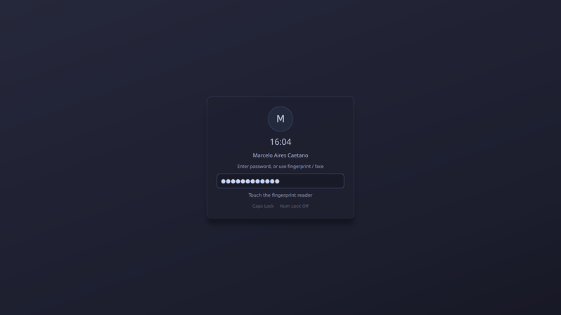
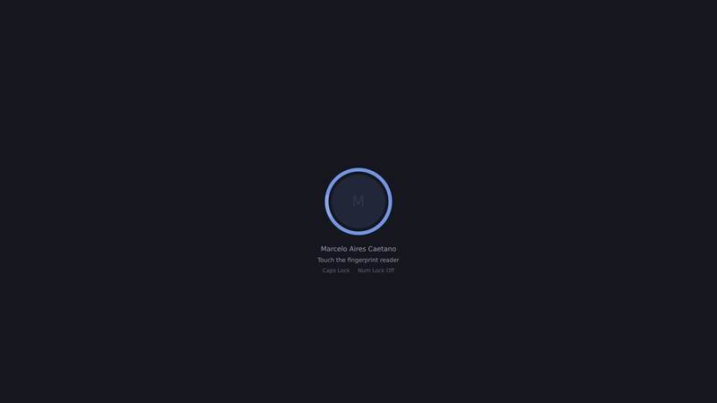

Lock screen
===========

``qbar-lock`` is an optional QML/PAM lock screen (built when ``pam`` is present)
that shares qbar's CSS engine. It picks its backend automatically: **Wayland** via
``ext-session-lock-v1`` (a real, secure session lock on sway/Hyprland/wlroots) or
**X11** via a keyboard+pointer grab (also set ``QT_QPA_PLATFORM=xcb`` there).

Two faces, chosen with ``--lock-style``:

The **panel** (default): avatar, clock, real name, password box, method hints and
Caps/Num indicators.

The **ring** (``--lock-style ring``): i3lock-style — a solid screen and a single
unlock ring that pulses per keystroke, spins while authenticating and flashes red
on failure.

.. code-block:: bash

   qbar-lock                                   # panel face
   qbar-lock --lock-style ring --theme \
       /usr/share/qbar/themes/i3lock.css       # i3lock-style ring

Failure feedback
----------------

Failed attempts are loud on both faces: the panel's password box **shakes** and
holds an error-red border (the ring shakes and flashes red), with the reason on
the error line. A rejected **fingerprint scan** gets the same treatment and
auto-clears after a moment — the reader re-arms itself and keeps listening.

Parallel unlock
---------------

Password, fingerprint and face run at once; the first to succeed wins:

* **Password** (always on) — the ``qbar-lock`` PAM service (``pam_unix``).
* **Fingerprint** (auto-detected) — driven over **fprintd's D-Bus API** (not
  ``pam_fprintd``), so it runs concurrently and cancels cleanly. Disable with
  ``--no-fingerprint``.
* **Face** (opt-in) — ``--face-pam-service qbar-lock-face``, a separate PAM stack
  using `Howdy <https://github.com/boltgolt/howdy>`_'s ``pam_howdy``.

Options
-------

.. list-table::
   :header-rows: 1
   :widths: 30 70

   * - Flag
     - Meaning
   * - ``--lock-style panel|ring``
     - Pick the face (default ``panel``). NB: the flag is ``--lock-style``, not
       ``--style`` (Qt reserves ``-style``).
   * - ``--theme <css>``
     - Stylesheet (``#lockscreen``, ``#auth-panel``, ``#password-input``,
       ``#lock-label``, ``#lock-error`` …). Bundled: ``bliss-98-lock``,
       ``macchiato-lock``, ``i3lock``.
   * - ``--backend auto|wayland|x11``
     - Lock backend (auto-detected).
   * - ``--no-fingerprint``
     - Disable fprintd unlock.
   * - ``--no-avatar``
     - Hide the user's avatar photo (a monogram disc is shown instead).
   * - ``--face-pam-service <svc>``
     - Enable face unlock through the given PAM stack.
   * - ``--demo``
     - Render without locking (for theming/screenshots; any password "succeeds").

The user's avatar and real name come from AccountsService
(``org.freedesktop.Accounts``, with ``~/.face`` / GECOS fallbacks).
