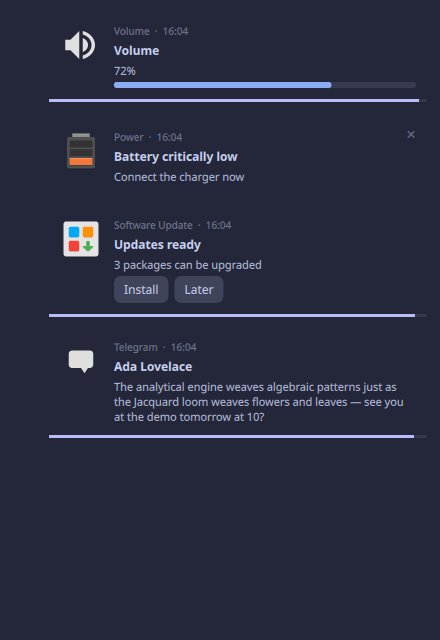

Notifications
=============

qbar ships a native ``org.freedesktop.Notifications`` daemon (Desktop Notifications
spec 1.2): with it enabled, toasts render through qbar's CSS engine instead of a
separate daemon like dunst or mako.

Enabling
--------

The daemon is **opt-in** — owning the notification bus name displaces whatever
daemon you already run, so it must be an explicit choice:

.. code-block:: json

   "notifications": {
     "enabled": true,
     "styleSheet": "themes/nord-notify.css",
     "corner": "top-right",
     "maxVisible": 5
   }

Stop the previous daemon first (``systemctl --user mask dunst.service``, or
uninstall mako). If another daemon still owns the bus name, qbar waits politely
and grabs it the moment the name frees up.

.. list-table::
   :header-rows: 1
   :widths: 22 14 64

   * - Key
     - Default
     - Meaning
   * - ``enabled``
     - ``false``
     - Own the bus name and render toasts. Not hot-reloadable (the D-Bus name
       registration is per-process).
   * - ``styleSheet``
     - *(unset)*
     - A dedicated stylesheet for the toasts, separate from the bar theme (like the
       lock's ``*-lock.css``). Relative paths resolve against the config dir; edits
       hot-reload. Unset = the toasts inherit the bar theme's ``#notification`` rules.
   * - ``corner``
     - ``top-right``
     - ``top-left`` | ``top-right`` | ``bottom-left`` | ``bottom-right``.
   * - ``maxVisible``
     - ``5``
     - Cards shown at once; the rest queue.
   * - ``timeout`` / ``timeoutLow`` / ``timeoutCritical``
     - ``6000`` / ``4000`` / ``0``
     - Expiry per urgency, ms. ``0`` = never (critical cards stay until dismissed).
   * - ``width`` / ``margin``
     - ``380`` / ``12``
     - Pixel fallbacks — the CSS ``#notifications { width; margin }`` wins.

Behaviour
---------

* **Hover to read**: a card whose summary/body is elided ("…") grows while hovered
  to show the full text; the expiry timer pauses while the pointer is on the card.
* **Click**: left-click invokes the notification's default action, or dismisses the
  card if it has no actions. **Right- or middle-click always dismisses.** The ✕
  appears on hover (always visible on critical cards).
* **Actions** render as buttons; ``value`` hints (0–100) render as a gauge — the
  volume/brightness OSD style.
* **Stack tags**: notifications carrying ``x-dunst-stack-tag``,
  ``x-canonical-private-synchronous``, ``private-synchronous`` or ``synchronous``
  hints coalesce into a single card per app + tag (updated in place, no re-entry
  animation) — so a volume-key repeat is one live gauge, not a stack of cards::

     notify-send -h string:synchronous:volume -h int:value:72 "Volume" "72%"

* ``replaces_id`` updates the existing card in place and restarts its countdown.

Theming
-------

Everything is standard CSS. Five bundled looks ship in ``config/themes/``:
``macchiato-notify``, ``aqua-glass-notify``, ``tokyo-night-notify``,
``nord-notify``, ``neon-shrine-notify``.

Selectors:

* ``#notifications`` — the stack: ``width``, ``margin-*``, ``spacing``.
* ``#notification`` — the card: ``background(-color)``, ``border-*``,
  ``border-radius``, ``box-shadow``, ``padding``, ``transition``, and the entry
  ``animation``. States: ``:low`` / ``:normal`` / ``:critical`` / ``:hover``.
* ``#notification:exit`` — the exit ``animation`` (or a ``transition`` to tune the
  default fade/slide).
* Parts: ``.app``, ``.summary``, ``.body``, ``.icon``, ``.close``, ``.action``
  (+ ``:hover``), ``.progress`` (countdown bar), ``.value`` (gauge).

Entry **and exit** animations are real ``@keyframes`` interpolating ``opacity``
and ``transform`` (``translateX/Y``, ``scale``):

.. code-block:: css

   @keyframes notif-in  { 0%   { opacity: 0; transform: translateX(340px) scale(0.96); }
                          70%  { opacity: 1; transform: translateX(-8px); }
                          100% { transform: translateX(0px); } }
   @keyframes notif-out { 0%   { opacity: 1; }
                          100% { opacity: 0; transform: translateY(-22px) scale(0.94); } }

   #notification       { animation: notif-in 320ms ease-out; }
   #notification:exit  { animation: notif-out 200ms ease-in; }

Per-urgency exits work too (``#notification:critical:exit``). Without keyframes the
cards fall back to a fade + slide toward the screen edge.

Frosted glass and emboss
------------------------

The bundled looks use translucent backgrounds on purpose. Add a compositor blur
rule on the ``qbar-notifications`` layer namespace and the cards become
gaussian-blurred glass — on Hyprland::

   layerrule = blur, qbar-notifications
   layerrule = ignorezero, qbar-notifications

``emboss: <0..1>`` on ``#notification`` swaps the flat fill for a shader-drawn
rounded slab with a soft gradient bevel (tune with ``emboss-highlight``,
``emboss-shadow``, ``emboss-edge``) — combined with the blur it reads as frosted
glass with relief.
